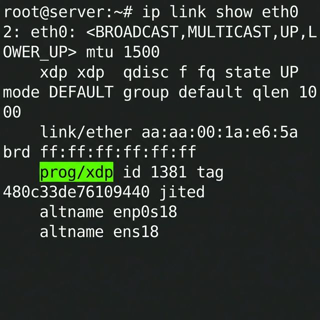

# Xray-Lite

A lightweight, high-performance Rust VLESS proxy with Reality & XHTTP support. Powered by eBPF kernel-level XDP Firewall and TC-EDT Traffic Pacing for ultimate stealth.

一个轻量级、高性能的纯 Rust 实现的 VLESS + Reality + xhttp 代理服务器。基于 eBPF 技术的 XDP 内核防火墙与 TC-EDT 流量整形，实现极致隐身与安全。

[Documentation](./docs/Home.md) | [x-ui-lite Panel](https://github.com/undead-undead/x-ui-lite) | [Report Bug](https://github.com/undead-undead/xray-lite/issues)


## Quick Installation / 快速安装

> **Note**: This is a **static compilation version** that works perfectly on **any Linux system** (Debian, Ubuntu, CentOS, Alpine, etc.) without dependency issues.
>
> **注意**：此为**静态编译版本**，完美适配**任何 Linux 系统** (Debian, Ubuntu, CentOS, Alpine 等)，无需担心依赖问题。

### 1. Standard Installation (Recommended) / 标准版安装（推荐）

> **Current Version: v0.4.6**

```bash
bash <(curl -fsSL https://raw.githubusercontent.com/undead-undead/xray-lite/main/install.sh)
```

### 2. 🔴 **[XDP Installation (Performance Enhanced) / XDP 版安装（性能增强版）](https://github.com/undead-undead/xray-lite/blob/main/docs/XDP_Features.md)**

> **Current Version: v0.6.0-xdp (Rate Limit)**
> 
> **Kernel Recommendations / 内核达标推荐**: 
> - **Optimal (最佳)**: Linux Kernel **≥ 5.15** (e.g., Ubuntu 22.04+, Debian 12+) - *Full XDP support.*
> - **Minimum (最低)**: Linux Kernel **≥ 5.4** - *Basic XDP support.*
> - **Note**: AMD64 Architecture & Root privileges required.

```bash
bash <(curl -fsSL https://raw.githubusercontent.com/undead-undead/xray-lite/feature/dynamic-xdp/install.sh)
```

### Deployment Verification / 部署验证

```bash
# Verify XDP Attachment / 验证 XDP 挂载
ip link show eth0
# Output: prog/xdp id 366 tag 480c33de76109440 jited
```



## Graphical Panel / 图形化面板

[x-ui-lite](https://github.com/undead-undead/x-ui-lite) is a lightweight web panel designed specifically for Xray-lite.
- **Hot Reload**: Supports seamless configuration updates for both **v0.4.6** (Standard) and **v0.6.0** (XDP) without service interruption.
- **Easy Management**: Visualize your traffic, manage clients, and monitor kernel-level XDP stats.

[x-ui-lite](https://github.com/undead-undead/x-ui-lite) 是专为 Xray-lite 设计的轻量化面板。
- **热重载支持**：完美适配 **v0.4.6** (标准版) 与 **v0.6.0** (XDP 版)，配置变更即时生效，无需重启服务。
- **便捷管理**：可视化流量统计、客户端管理及 XDP 内核防火墙状态监控。


If you think the project is good, you can support the developers.


https://buymeacoffee.com/undeadundead


crypto:

Sol: 9QFKQ3jpBSuNPLZQH1uq5GrJm4RDKue82zeVaXwazcmj


Base：0x4cf0b79aea1c229dfb1df9e2b40ea5dd04f37969


## Contributing / 贡献

We welcome all kinds of contributions! Please verify that `cargo test` passes before submitting a PR.
欢迎各种形式的贡献！提交 PR 前请确保通过 `cargo test`。

## License / 许可证

[MPL-2.0](LICENSE)
